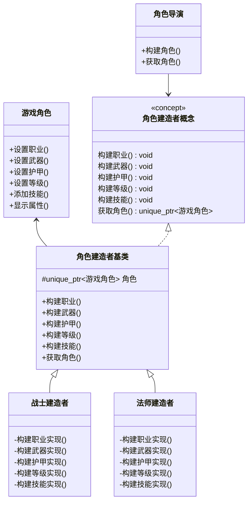

# 游戏角色建造者模式实现解析

建造者模式是一种创建型设计模式，它允许你分步骤创建复杂对象，特别适合需要创建具有多个组成部分的对象场景。在游戏角色创建系统中，这种模式尤为适用。

## 设计结构

### 1. 产品类 - `游戏角色`
```cpp
class 游戏角色 {
public:
    void 设置职业(std::string_view 职业);
    void 设置武器(std::string_view 武器);
    void 设置护甲(std::string_view 护甲);
    void 设置等级(int 等级);
    void 添加技能(std::string_view 技能);
    void 显示属性() const;
private:
    std::string 职业{"未选择"};
    std::string 武器{"无"};
    std::string 护甲{"无"};
    int 等级{1};
    std::vector<std::string> 技能列表;
};
```
- **职责**：代表最终要创建的复杂对象
- **特点**：
  - 包含角色所有属性（职业、武器、护甲等）
  - 提供设置各部分属性的方法
  - 提供展示完整属性的方法

### 2. 建造者概念 - `角色建造者概念`
```cpp
template <typename T>
concept 角色建造者概念 = requires(T t) {
    { t.构建职业() } -> std::same_as<void>;
    { t.构建武器() } -> std::same_as<void>;
    // ... 其他构建方法要求 ...
    { t.获取角色() } -> std::convertible_to<std::unique_ptr<游戏角色>>;
};
```
- **目的**：使用C++20概念约束建造者接口
- **优点**：
  - 编译时检查建造者是否满足要求
  - 提供清晰的接口契约
  - 替代传统抽象基类方式

### 3. 建造者基类 - `角色建造者基类`
```cpp
template <typename 角色建造者类型> 
class 角色建造者基类 {
protected:
    std::unique_ptr<游戏角色> 角色 = std::make_unique<游戏角色>();
public:
    void 构建职业() { 
        static_cast<角色建造者类型*>(this)->构建职业实现(); 
    }
    // ... 其他构建方法 ...
    std::unique_ptr<游戏角色> 获取角色() { 
        return std::move(角色); 
    }
};
```
- **设计特点**：
  - 使用CRTP（奇异递归模板模式）实现静态多态
  - 持有产品实例的unique_ptr
  - 提供默认构建方法转发到具体实现

### 4. 具体建造者实现
```cpp
class 战士建造者 : public 角色建造者基类<战士建造者> {
private:
    void 构建职业实现() { 角色->设置职业("狂战士"); }
    void 构建武器实现() { 角色->设置武器("巨剑"); }
    // ... 其他具体实现 ...
};
```
- **战士建造者特点**：
  - 设置职业为"狂战士"
  - 武器为"巨剑"
  - 护甲为"板甲"
  - 特定技能：旋风斩、狂暴、冲锋

- **法师建造者特点**：
  - 职业："大法师"
  - 武器："法杖"
  - 护甲："布甲"
  - 技能：火球术、寒冰箭、传送术

- **弓箭手建造者特点**：
  - 职业："神射手"
  - 武器："长弓"
  - 护甲："皮甲"
  - 技能：多重射击、精准射击、陷阱布置

### 5. 导演类 - `角色导演`
```cpp
template <角色建造者概念 T> 
class 角色导演 {
public:
    角色导演(T& 建造者) : 建造者(&建造者) {}
    
    void 构建角色() {
        建造者->构建职业();
        建造者->构建武器();
        // ... 按顺序调用构建步骤 ...
    }
    
    std::unique_ptr<游戏角色> 获取角色() { 
        return 建造者->获取角色(); 
    }
private:
    T* 建造者;
};
```
- **职责**：
  - 控制构建过程顺序
  - 隔离客户端与具体构建过程
  - 复用相同的构建流程创建不同产品

### 6. 工厂函数 - `创建角色`
```cpp
template <角色建造者概念 T> 
std::unique_ptr<游戏角色> 创建角色() {
    T 建造者;
    角色导演 导演(建造者);
    导演.构建角色();
    return 导演.获取角色();
}
```
- **目的**：简化客户端创建过程
- **优点**：封装建造者和导演的使用细节

## 建造者模式优势

1. **分步构建复杂对象**
   - 将复杂对象的创建分解为多个简单步骤
   - 允许精细控制创建过程

2. **复用构建过程**
   - 相同构建过程可创建不同表示
   - 导演类封装通用构建流程

3. **单一职责原则**
   - 业务逻辑与对象构造分离
   - 具体建造者只负责特定产品变体

4. **开闭原则**
   - 新增建造者无需修改现有代码
   - 扩展性良好（如添加新角色类型）

## 在游戏角色系统中的价值

1. **灵活的角色创建**
   - 轻松添加新职业（如盗贼、牧师）
   - 自定义角色属性组合

2. **构建过程标准化**
   - 确保所有角色都有完整属性集
   - 避免遗漏重要设置步骤

3. **复杂对象创建封装**
   - 客户端只需指定角色类型
   - 隐藏具体构建细节

4. **多平台适配**
   - 可为不同平台提供不同实现
   - 保持相同创建接口

## 使用示例
```cpp
int main() {
    // 使用工厂函数创建战士
    auto 战士角色 = 创建角色<战士建造者>();
    战士角色->显示属性();

    // 直接使用导演创建法师
    法师建造者 法师建造者实例;
    角色导演 法师导演(法师建造者实例);
    法师导演.构建角色();
    auto 法师角色 = 法师导演.获取角色();
    法师角色->显示属性();
}
```

## 总结

建造者模式通过分离对象构造与表示，提供了一种创建复杂对象的优雅解决方案。在游戏角色创建系统中：

1. 产品类（游戏角色）封装最终对象
2. 建造者概念定义构建接口
3. 具体建造者实现不同产品变体
4. 导演控制构建流程
5. 客户端通过高层接口创建对象

这种设计使得添加新角色类型变得简单（只需添加新的具体建造者），同时保持现有代码不变，完美符合开闭原则。建造者模式特别适用于需要创建具有多个组成部分的复杂对象场景。

# 游戏角色建造者模式实现与自定义角色扩展

## 建造者模式核心设计

### 基础结构


## 自定义角色构建思路

### 1. 参数化建造者模式

```cpp
class 自定义建造者 : public 角色建造者基类<自定义建造者> {
public:
    // 自定义设置方法
    void 设置自定义职业(std::string_view 职业) {
        自定义职业 = 职业;
        职业已设置 = true;
    }
    
    void 添加自定义技能(std::string_view 技能) {
        自定义技能.push_back(std::string(技能));
    }

private:
    void 构建职业实现() override {
        if (职业已设置) {
            角色->设置职业(自定义职业);
        } else {
            角色->设置职业("冒险者"); // 默认值
        }
    }
    
    void 构建技能实现() override {
        // 添加基础技能
        角色->添加技能("基础攻击");
        
        // 添加自定义技能
        for (const auto& 技能 : 自定义技能) {
            角色->添加技能(技能);
        }
    }
    
    std::string 自定义职业{"冒险者"};
    std::vector<std::string> 自定义技能;
    bool 职业已设置 = false;
};
```

### 2. 混合建造者模式

```cpp
class 混合角色导演 {
public:
    template <角色建造者概念 T>
    std::unique_ptr<游戏角色> 构建混合角色(T& 基础建造者, 
                                        const 自定义选项& 选项) {
        角色导演<T> 导演(基础建造者);
        导演.构建角色();
        auto 角色 = 导演.获取角色();
        
        // 应用自定义选项
        if (!选项.武器.empty()) {
            角色->设置武器(选项.武器);
        }
        if (选项.等级 > 0) {
            角色->设置等级(选项.等级);
        }
        for (const auto& 技能 : 选项.额外技能) {
            角色->添加技能(技能);
        }
        
        return 角色;
    }
};
```

### 3. 建造者配置器模式

```cpp
class 角色配置器 {
public:
    角色配置器& 设置职业(std::string_view 职业) {
        职业配置 = 职业;
        return *this;
    }
    
    角色配置器& 设置武器(std::string_view 武器) {
        武器配置 = 武器;
        return *this;
    }
    
    角色配置器& 添加技能(std::string_view 技能) {
        技能配置.push_back(std::string(技能));
        return *this;
    }
    
    std::unique_ptr<游戏角色> 构建() {
        auto 角色 = std::make_unique<游戏角色>();
        角色->设置职业(职业配置);
        角色->设置武器(武器配置);
        for (const auto& 技能 : 技能配置) {
            角色->添加技能(技能);
        }
        return 角色;
    }

private:
    std::string 职业配置{"自由职业"};
    std::string 武器配置{"短剑"};
    std::vector<std::string> 技能配置;
};

// 使用示例
auto 角色 = 角色配置器{}
    .设置职业("暗影刺客")
    .设置武器("双匕首")
    .添加技能("潜行")
    .添加技能("背刺")
    .构建();
```

### 4. 预设模板扩展

```cpp
class 预设角色工厂 {
public:
    enum 预设类型 { 精灵射手, 矮人战士, 黑暗法师 };
    
    static std::unique_ptr<游戏角色> 创建预设角色(预设类型 类型) {
        switch (类型) {
            case 精灵射手:
                return 创建角色<精灵射手建造者>();
            case 矮人战士:
                return 创建角色<矮人战士建造者>();
            case 黑暗法师:
                return 创建角色<黑暗法师建造者>();
            default:
                return 创建角色<基础建造者>();
        }
    }
    
    static std::unique_ptr<游戏角色> 自定义预设角色(预设类型 类型, 
                                                const 自定义选项& 选项) {
        auto 角色 = 创建预设角色(类型);
        // 应用自定义修改
        if (!选项.护甲.empty()) {
            角色->设置护甲(选项.护甲);
        }
        // ... 其他自定义
        return 角色;
    }
};
```

## 自定义角色实现策略对比

| 方法 | 优点 | 缺点 | 适用场景 |
|------|------|------|----------|
| **参数化建造者** | 高度可定制，保持建造者模式结构 | 增加建造者复杂性 | 需要深度定制的角色 |
| **混合建造者** | 基础属性复用预设，部分属性可定制 | 破坏建造者封装性 | 预设角色微调 |
| **建造者配置器** | 简单直观，灵活性强 | 缺乏预设一致性 | 完全自定义角色 |
| **预设模板扩展** | 保持预设质量，提供定制入口 | 定制选项有限 | 预设基础上的有限定制 |

## 自定义角色使用示例

```cpp
int main() {
    // 方法1: 参数化建造者
    自定义建造者 建造者;
    建造者.设置自定义职业("龙骑士");
    建造者.添加自定义技能("龙吼");
    建造者.添加自定义技能("火焰吐息");
    角色导演 导演(建造者);
    导演.构建角色();
    auto 龙骑士 = 导演.获取角色();
    
    // 方法2: 混合建造者
    战士建造者 基础战士;
    自定义选项 选项;
    选项.武器 = "火焰巨剑";
    选项.额外技能 = {"烈焰斩", "火抗强化"};
    混合角色导演 混合导演;
    auto 火焰战士 = 混合导演.构建混合角色(基础战士, 选项);
    
    // 方法3: 配置器
    auto 暗影刺客 = 角色配置器{}
        .设置职业("暗影刺客")
        .设置武器("淬毒匕首")
        .添加技能("暗影步")
        .添加技能("致命毒药")
        .构建();
    
    // 方法4: 预设模板
    auto 精灵射手 = 预设角色工厂::创建预设角色(预设角色工厂::精灵射手);
    auto 黑暗精灵射手 = 预设角色工厂::自定义预设角色(
        预设角色工厂::精灵射手, 
        {.护甲 = "暗影皮甲", .额外技能 = {"暗影箭"}}
    );
    
    // 显示所有角色
    std::vector 角色列表{龙骑士.get(), 火焰战士.get(), 
                     暗影刺客.get(), 精灵射手.get(), 黑暗精灵射手.get()};
    for (auto 角色 : 角色列表) {
        角色->显示属性();
    }
}
```

## 自定义角色设计原则

1. **渐进式复杂度原则**
   - 提供预设角色作为起点
   - 允许逐层添加自定义选项
   - 保持默认合理的配置

2. **开放/封闭原则**
   ```cpp
   // 易于扩展新角色类型
   class 德鲁伊建造者 : public 角色建造者基类<德鲁伊建造者> {
       // 实现德鲁伊特有构建逻辑
   };
   
   // 添加新预设无需修改现有代码
   预设角色工厂::添加预设("德鲁伊", []{
       return 创建角色<德鲁伊建造者>();
   });
   ```

3. **验证与约束**
   ```cpp
   void 角色配置器::设置职业(std::string_view 职业) {
       if (有效职业列表.find(职业) == 有效职业列表.end()) {
           throw std::invalid_argument("无效的职业");
       }
       职业配置 = 职业;
   }
   ```

4. **组合式技能系统**
   ```cpp
   void 游戏角色::添加技能(std::string_view 技能) {
       if (技能树.可以学习(技能)) {
           技能列表.push_back(std::string(技能));
       } else {
           throw 技能冲突异常("无法学习该技能");
       }
   }
   ```

## 总结与最佳实践

建造者模式在游戏角色创建系统中提供了强大的灵活性：

1. **预设与自定义的平衡**
   - 使用建造者模式提供精心设计的预设角色
   - 通过扩展点允许玩家自定义关键属性
   - 保持核心游戏平衡性约束

2. **混合方法优势**
   ```cpp
   // 结合预设和自定义的最佳实践
   auto 创建高级角色(预设类型 基础, 自定义选项 选项) {
       auto 角色 = 预设角色工厂::创建预设角色(基础);
       角色->设置武器(选项.武器);
       for (const auto& 技能 : 选项.技能) {
           角色->添加技能(技能);
       }
       return 角色;
   }
   ```

3. **动态构建流程**
   ```cpp
   class 动态导演 {
   public:
       void 添加构建步骤(std::function<void(游戏角色&)> 步骤) {
           构建流程.push_back(步骤);
       }
       
       std::unique_ptr<游戏角色> 构建角色() {
           auto 角色 = std::make_unique<游戏角色>();
           for (auto& 步骤 : 构建流程) {
               步骤(*角色);
           }
           return 角色;
       }
   private:
       std::vector<std::function<void(游戏角色&)>> 构建流程;
   };
   ```

4. **可扩展架构**
   - 通过添加新建造者支持新角色类型
   - 通过配置接口支持玩家自定义
   - 通过验证机制维护游戏平衡性

建造者模式为游戏角色系统提供了兼顾标准化和个性化的创建方案，使开发者能够提供精心设计的预设角色，同时允许玩家通过可控的自定义选项创造独特的游戏体验。
