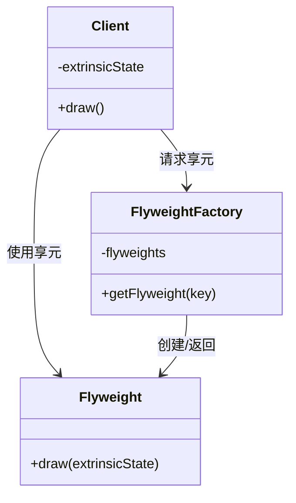

# 享元模式 (Flyweight Pattern) 简明指南

## 什么是享元模式？
享元模式是一种**结构型设计模式**，它通过共享对象来最小化内存使用，特别适合处理大量相似对象时节省内存。

## 为什么需要享元模式？
在游戏开发中，当需要创建大量相似对象时（如子弹、粒子等），每个对象都包含相同的数据（如纹理）会消耗大量内存。享元模式通过共享这些**不变的部分**来解决这个问题。

### 问题示例
```cpp
struct Bullet {
    vec3 position;
    vec3 velocity;
    贴图 texture; // 每个子弹都存储完整的纹理数据

    void draw() {
        绘制纹理(position, texture);
    }
};
```
- 创建1000颗子弹 → 存储1000份相同的纹理数据
- 内存浪费严重

## 享元模式解决方案
将对象分为：
1. **内部状态（Intrinsic State）**：不变的部分（可共享）
2. **外部状态（Extrinsic State）**：变化的部分（不可共享）

### 解决方案代码
```cpp
// 享元类：存储共享的内部状态
struct Sprite {
    vector<char> texture; // 大内存消耗的部分

    void draw(glm::vec3 position) {
        绘制纹理(position, texture);
    }
};

// 客户端类：存储变化的外部状态
struct Bullet {
    glm::vec3 position;
    glm::vec3 velocity;
    shared_ptr<Sprite> sprite; // 共享Sprite实例

    void draw() {
        sprite->draw(position); // 转发绘制请求
    }
};
```

## 模式结构


## 游戏子弹系统示例

### 享元类（共享纹理）
```cpp
class Sprite {
private:
    vector<char> texture; // 大内存消耗的内部状态

public:
    Sprite(const vector<char>& tex) : texture(tex) {}
    
    void draw(glm::vec3 position) {
        // 实际绘制逻辑
        cout << "在位置(" << position.x << "," 
             << position.y << ")绘制纹理\n";
    }
};
```

### 享元工厂（管理共享）
```cpp
class SpriteFactory {
private:
    static unordered_map<string, shared_ptr<Sprite>> sprites;

public:
    static shared_ptr<Sprite> getSprite(const string& type) {
        if(sprites.find(type) == sprites.end()) {
            // 根据类型创建新精灵
            vector<char> texture = loadTexture(type);
            sprites[type] = make_shared<Sprite>(texture);
        }
        return sprites[type];
    }
};
unordered_map<string, shared_ptr<Sprite>> SpriteFactory::sprites;
```

### 客户端类（子弹）
```cpp
class Bullet {
private:
    glm::vec3 position;
    glm::vec3 velocity;
    shared_ptr<Sprite> sprite;

public:
    Bullet(glm::vec3 pos, glm::vec3 vel, const string& type)
        : position(pos), velocity(vel), 
          sprite(SpriteFactory::getSprite(type)) {}
    
    void update() {
        position += velocity;
    }
    
    void draw() {
        sprite->draw(position); // 委托给享元对象
    }
};
```

### 使用示例
```cpp
int main() {
    vector<Bullet> bullets;
    
    // 创建1000个火焰弹
    for(int i = 0; i < 1000; i++) {
        bullets.emplace_back(
            glm::vec3(i, 0, 0), 
            glm::vec3(0, 1, 0),
            "fire"
        );
    }
    
    // 创建500个冰弹
    for(int i = 0; i < 500; i++) {
        bullets.emplace_back(
            glm::vec3(i, 0, 0), 
            glm::vec3(0, -1, 0),
            "ice"
        );
    }
    
    // 更新和绘制所有子弹
    for(auto& bullet : bullets) {
        bullet.update();
        bullet.draw();
    }
    
    return 0;
}
```

## 享元模式优点
1. **大幅减少内存使用**：共享相同状态的对象
2. **提高性能**：减少对象创建开销
3. **简化客户端代码**：客户端只需管理外部状态
4. **更好的资源管理**：集中管理共享资源

## 适用场景
- 需要创建大量相似对象
- 对象的大部分状态可以外部化
- 应用程序不依赖对象标识
- 典型应用：
  - 游戏开发（子弹、粒子、NPC）
  - 文字编辑器（字符对象）
  - 图形系统（图元对象）

## 关键概念对比
| 概念 | 说明 | 示例 |
|------|------|------|
| **内部状态** | 不变的部分，可共享 | 子弹纹理 |
| **外部状态** | 变化的部分，不可共享 | 子弹位置、速度 |
| **享元对象** | 存储内部状态 | Sprite类 |
| **客户端对象** | 存储外部状态 | Bullet类 |
| **享元工厂** | 管理共享资源 | SpriteFactory |

## 实现要点
1. **分离内部状态和外部状态**
2. **创建享元工厂管理共享实例**
3. **客户端在操作时传递外部状态**
4. **考虑线程安全（如需要）**

## 与外观模式的区别
| 模式 | 目的 | 关注点 |
|------|------|--------|
| **外观模式** | 简化复杂系统接口 | 接口简化 |
| **享元模式** | 优化内存使用 | 资源共享 |

**享元模式就像图书馆的书籍共享**：  
每个人都无需购买相同的书（内部状态），只需从图书馆借阅（共享），然后在自己需要的地方（外部状态）阅读即可。
