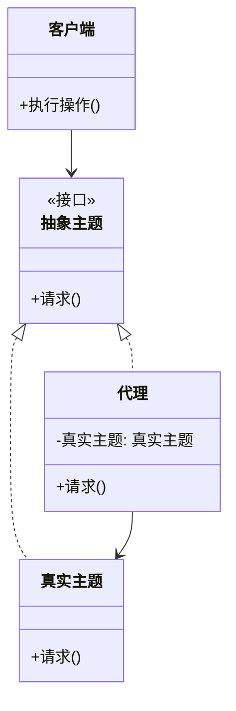

# 代理模式 (Proxy Pattern) 详解

## 什么是代理模式？
代理模式是一种**结构型设计模式**，它提供一个代理对象来控制对原始对象的访问。代理对象在客户端和目标对象之间充当中间人，可以在访问目标对象前后添加额外的操作。

## 为什么需要代理模式？
想象你需要联系一位名人：
- 你不能直接打电话给他（目标对象）
- 你需要联系他的经纪人（代理）
- 经纪人会处理你的请求（过滤、转发、添加额外操作）

代理模式在软件开发中常见于以下场景：
- 控制访问权限（保护代理）
- 延迟初始化（虚拟代理）
- 缓存结果（缓存代理）
- 记录日志（日志代理）
- 远程对象访问（远程代理）

## 模式结构


### 核心角色
1. **抽象主题 (Subject)**：定义真实主题和代理的共同接口
2. **真实主题 (Real Subject)**：实际执行业务逻辑的对象
3. **代理 (Proxy)**：控制对真实主题的访问，并可能添加额外功能
4. **客户端 (Client)**：通过代理与真实主题交互

## 代理模式类型

### 1. 虚拟代理 (Virtual Proxy)
延迟创建开销大的对象，直到真正需要时才创建

```cpp
import <iostream>;
import <memory>;
import <print>;

// 抽象主题
class 图像 {
public:
    virtual void 显示() = 0;
    virtual ~图像() = default;
};

// 真实主题
class 高分辨率图像 : public 图像 {
    std::string 文件名;
    
public:
    高分辨率图像(const std::string& 名称) : 文件名(名称) {
        从磁盘加载(); // 模拟高开销操作
    }
    
    void 显示() override {
        std::println("显示高分辨率图像: {}", 文件名);
    }
    
private:
    void 从磁盘加载() {
        std::println("从磁盘加载图像: {} (高开销操作)", 文件名);
    }
};

// 代理
class 图像代理 : public 图像 {
    std::string 文件名;
    std::unique_ptr<高分辨率图像> 真实图像;
    
public:
    图像代理(const std::string& 名称) : 文件名(名称) {}
    
    void 显示() override {
        if (!真实图像) {
            真实图像 = std::make_unique<高分辨率图像>(文件名);
        }
        真实图像->显示();
    }
};

int main() {
    std::println("===== 虚拟代理示例 =====");
    
    // 创建代理对象（此时不加载图像）
    图像代理 代理("假期照片.jpg");
    std::println("代理已创建，图像尚未加载");
    
    // 第一次访问时才加载图像
    std::println("\n第一次显示图像:");
    代理.显示();
    
    // 后续访问直接使用已加载的图像
    std::println("\n第二次显示图像:");
    代理.显示();
}
```

### 2. 保护代理 (Protection Proxy)
控制对敏感对象的访问权限

```cpp
import <iostream>;
import <string>;
import <print>;

// 抽象主题
class 数据库 {
public:
    virtual void 查询(const std::string& SQL语句) = 0;
    virtual ~数据库() = default;
};

// 真实主题
class 真实数据库 : public 数据库 {
public:
    void 查询(const std::string& SQL语句) override {
        std::println("执行查询: {}", SQL语句);
    }
};

// 代理
class 数据库代理 : public 数据库 {
    真实数据库 真实数据库实例;
    std::string 用户角色;
    
public:
    数据库代理(const std::string& 角色) : 用户角色(角色) {}
    
    void 查询(const std::string& SQL语句) override {
        if (检查权限()) {
            真实数据库实例.查询(SQL语句);
        } else {
            std::println("拒绝访问: 用户'{}'没有权限执行查询", 用户角色);
        }
    }
    
private:
    bool 检查权限() const {
        return 用户角色 == "管理员";
    }
};

int main() {
    std::println("\n===== 保护代理示例 =====");
    
    // 管理员访问
    数据库代理 管理员代理("管理员");
    管理员代理.查询("SELECT * FROM 用户表");
    
    // 普通用户访问
    数据库代理 普通用户代理("普通用户");
    普通用户代理.查询("DROP TABLE 用户表");
}
```

### 3. 远程代理 (Remote Proxy)
为位于不同地址空间的对象提供本地代表

```cpp
import <iostream>;
import <string>;
import <print>;

// 抽象主题 (接口)
class 支付服务 {
public:
    virtual void 支付(double 金额) = 0;
    virtual ~支付服务() = default;
};

// 远程服务 (可能位于另一台服务器)
class 远程支付服务 : public 支付服务 {
public:
    void 支付(double 金额) override {
        std::println("远程处理支付: ${}", 金额);
        // 实际网络通信逻辑...
    }
};

// 代理 (处理网络通信细节)
class 支付代理 : public 支付服务 {
    远程支付服务 远程服务;
    
public:
    void 支付(double 金额) override {
        std::println("本地代理: 准备支付请求...");
        
        // 处理网络通信细节
        序列化请求(金额);
        连接服务器();
        
        // 转发请求到远程服务
        远程服务.支付(金额);
        
        // 处理响应
        处理响应();
        std::println("本地代理: 支付处理完成");
    }
    
private:
    void 序列化请求(double 金额) {
        std::println("序列化请求: ${}", 金额);
    }
    
    void 连接服务器() {
        std::println("连接到支付服务器...");
    }
    
    void 处理响应() {
        std::println("处理服务器响应...");
    }
};

int main() {
    std::println("\n===== 远程代理示例 =====");
    
    支付代理 代理;
    代理.支付(99.99);
}
```

### 4. 智能引用代理 (Smart Reference Proxy)
在访问对象时添加额外行为

```cpp
import <iostream>;
import <memory>;
import <unordered_map>;
import <print>;

// 抽象主题
class 视频 {
public:
    virtual void 播放() = 0;
    virtual ~视频() = default;
};

// 真实主题
class 真实视频 : public 视频 {
    std::string 标题;
    
public:
    真实视频(const std::string& 标题) : 标题(标题) {}
    
    void 播放() override {
        std::println("播放视频: {}", 标题);
    }
};

// 代理 (添加缓存和访问统计)
class 视频代理 : public 视频 {
    std::string 标题;
    static std::unordered_map<std::string, std::shared_ptr<真实视频>> 缓存;
    static std::unordered_map<std::string, int> 访问次数;
    
public:
    视频代理(const std::string& 标题) : 标题(标题) {}
    
    void 播放() override {
        // 延迟加载
        if (缓存.find(标题) == 缓存.end()) {
            缓存[标题] = std::make_shared<真实视频>(标题);
            std::println("创建新视频对象: {}", 标题);
        }
        
        // 访问统计
        访问次数[标题]++;
        std::println("视频 '{}' 被访问 {} 次", 标题, 访问次数[标题]);
        
        // 播放视频
        缓存[标题]->播放();
    }
};

// 静态成员初始化
std::unordered_map<std::string, std::shared_ptr<真实视频>> 视频代理::缓存;
std::unordered_map<std::string, int> 视频代理::访问次数;

int main() {
    std::println("\n===== 智能引用代理示例 =====");
    
    视频代理 视频1("黑客帝国");
    视频代理 视频2("盗梦空间");
    
    视频1.播放();
    视频2.播放();
    视频1.播放();
}
```

## 代理模式优点
1. **访问控制**：代理可以控制对真实主题的访问
2. **延迟初始化**：虚拟代理可延迟高开销对象的创建
3. **增强功能**：在不修改原对象的情况下添加新功能
4. **职责分离**：代理处理额外逻辑，真实主题专注核心功能
5. **性能优化**：缓存代理可提高系统性能

## 代理模式 vs 其他模式

| 模式 | 区别 |
|------|------|
| **装饰器模式** | 添加功能，而代理控制访问 |
| **适配器模式** | 改变接口，而代理保持相同接口 |
| **外观模式** | 简化复杂系统接口，而代理控制对单个对象的访问 |

## 实际应用场景
1. **网络代理**：隐藏真实服务器地址
2. **权限控制**：保护敏感资源访问
3. **缓存机制**：缓存数据库查询结果
4. **日志记录**：记录对象访问历史
5. **延迟加载**：提高应用启动速度
6. **分布式系统**：远程对象访问

## 总结
代理模式是一种强大的设计模式，它通过引入代理对象来控制对原始对象的访问。这种模式在以下场景特别有用：
- 需要控制对对象的访问时
- 需要添加额外功能而不修改原始对象时
- 需要优化系统性能时（如延迟加载、缓存）

代理模式的核心在于**分离关注点**：
- 真实主题：专注核心业务逻辑
- 代理：处理访问控制和额外功能

掌握代理模式可以帮助你构建更加灵活、安全和高性能的系统架构。
