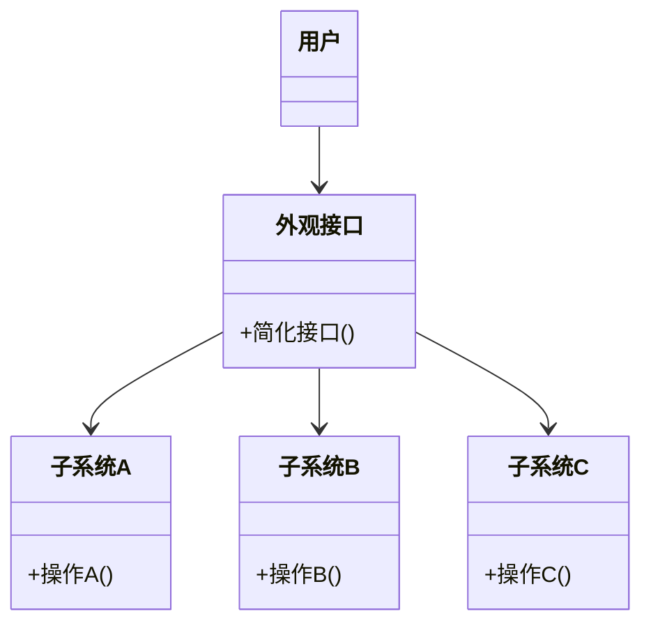

# 外观模式 (Facade Pattern) 简明指南

## 什么是外观模式？
外观模式是一种**结构型设计模式**，它为复杂的子系统提供一个简化的接口。这个接口隐藏了系统的复杂性，使客户端更容易使用系统。

## 为什么需要外观模式？
想象你驾驶汽车时：
- 你只需要转动方向盘、踩油门/刹车这些简单操作
- 而不需要知道引擎、传动系统、电子控制系统等复杂部件的运作细节

外观模式就是为复杂系统提供这样一个"方向盘"级别的简单接口！

## 模式结构


## 游戏技能系统示例
我们通过一个游戏技能释放系统来说明外观模式：

### 复杂子系统
```cpp
// 动画子系统
class 动画系统 {
public:
  void 播放动画(const std::string &动画名称) {
    std::cout << std::format("[动画系统] 播放动画: {}\n", 动画名称);
  }
};

// 音效子系统
class 音效系统 {
public:
  void 播放音效(const std::string &音效名称) {
    std::cout << std::format("[音效系统] 播放音效: {}\n", 音效名称);
  }
};

// 粒子子系统
class 粒子系统 {
public:
  void 生成粒子(const std::string &粒子效果) {
    std::cout << std::format("[粒子系统] 生成粒子: {}\n", 粒子效果);
  }
};

// 伤害计算子系统
class 伤害系统 {
public:
  void 计算伤害(int 目标ID, int 伤害值) {
    std::cout << std::format("[伤害系统] 对目标{}造成{}点伤害\n", 目标ID, 伤害值);
  }
};
```

### 外观类（简化接口）
```cpp
class 技能释放外观 {
private:
  动画系统 动画;
  音效系统 音效;
  粒子系统 粒子;
  伤害系统 伤害;

public:
  void 释放火球术(int 目标ID) {
    std::cout << "======= 释放火球术 =======\n";
    动画.播放动画("火球投掷");
    音效.播放音效("火球施放");
    粒子.生成粒子("火焰轨迹");
    粒子.生成粒子("爆炸火花");
    伤害.计算伤害(目标ID, 150);
    音效.播放音效("爆炸音效");
    std::cout << "=========================\n\n";
  }

  void 释放治疗术(int 目标ID) {
    std::cout << "======= 释放治疗术 =======\n";
    动画.播放动画("神圣手势");
    音效.播放音效("治愈铃音");
    粒子.生成粒子("圣光粒子");
    粒子.生成粒子("治愈光环");
    伤害.计算伤害(目标ID, -80); // 负值表示治疗
    音效.播放音效("治愈完成");
    std::cout << "=========================\n\n";
  }
};
```

### 客户端使用
```cpp
int main() {
  技能释放外观 技能释放器;

  // 简单调用接口，无需知道子系统细节
  技能释放器.释放火球术(1001); // 对敌人1001释放火球术
  技能释放器.释放治疗术(2001); // 对队友2001释放治疗术

  return 0;
}
```

## 输出示例
```
======= 释放火球术 =======
[动画系统] 播放动画: 火球投掷
[音效系统] 播放音效: 火球施放
[粒子系统] 生成粒子: 火焰轨迹
[粒子系统] 生成粒子: 爆炸火花
[伤害系统] 对目标1001造成150点伤害
[音效系统] 播放音效: 爆炸音效
=========================

======= 释放治疗术 =======
[动画系统] 播放动画: 神圣手势
[音效系统] 播放音效: 治愈铃音
[粒子系统] 生成粒子: 圣光粒子
[粒子系统] 生成粒子: 治愈光环
[伤害系统] 对目标2001造成-80点伤害
[音效系统] 播放音效: 治愈完成
=========================
```

## 外观模式优点
1. **简化接口**：提供统一的高级接口
2. **解耦**：客户端与子系统解耦
3. **易用性**：降低使用复杂度
4. **可维护性**：子系统变化不影响客户端

## 适用场景
- 为复杂模块或库提供简单接口
- 当系统有多个复杂子系统需要统一入口
- 分层系统中，为每层提供入口点

## 关键点总结
| 概念 | 说明 |
|------|------|
| 核心思想 | 用一个简单接口封装复杂子系统 |
| 主要角色 | 外观(Facade)、子系统(Subsystems) |
| 客户端 | 只与外观交互，不与子系统直接耦合 |
| 设计原则 | 遵循最少知识原则（迪米特法则） |

**外观模式就像餐厅的服务员**：  
你不需要直接与厨师、收银员、清洁工等交互，只需告诉服务员你的需求，他会协调所有后台工作！
