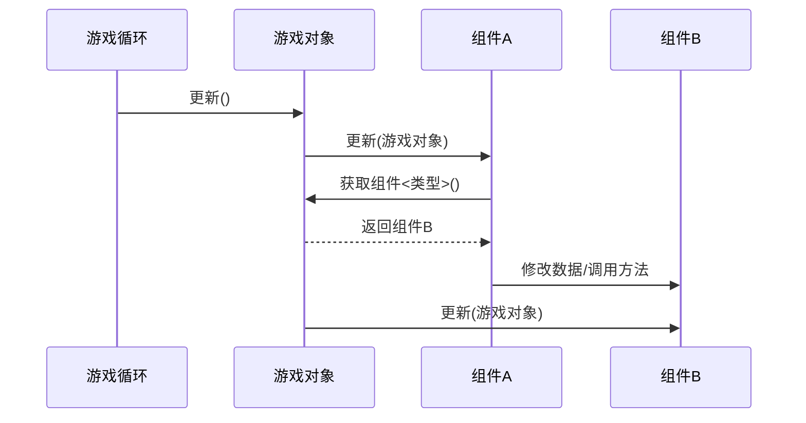

# 组件模式（Component Pattern）原理精解

## 🧩 核心思想
**组件模式的核心是将单一实体拆分为多个独立、可复用的功能模块（组件）**，通过组合而非继承的方式构建复杂对象。每个组件只关注单一职责，游戏对象作为容器动态管理这些组件。

## 🔧 三大核心要素

1. **组件（Component）**
   - 功能独立的功能模块（如移动、渲染、控制）
   - 实现统一接口（如`更新()`方法）
   - **必须声明虚析构函数**确保正确释放资源

2. **游戏对象（GameObject）**
   - 组件的容器和协调者
   - 管理组件生命周期（添加/移除）
   - 调度组件更新（如每帧调用`更新()`）

3. **组件管理系统**
   - 存储：使用容器（如`vector`）存放组件
   - 查找：通过类型索引快速获取组件
   - 通信：提供组件间交互机制

## ⚙️ 工作流程



## 💡 关键特性

1. **动态组合**
   - 运行时添加/移除组件
   - 无需修改代码即可创建新对象类型
   ```cpp
   auto 玩家 = std::make_unique<游戏对象>("玩家");
   玩家->添加组件<可移动组件>();
   玩家->添加组件<玩家控制组件>();
   ```

2. **组件通信**
   - **直接获取**：通过游戏对象查找其他组件
   ```cpp
   if (auto 移动组件 = 所属对象->获取组件<可移动组件>()) {
       移动组件->当前速度.y += 0.1f;
   }
   ```
   
   - **事件系统**：广播事件给所有组件
   ```cpp
   int 伤害值 = 15;
   敌人->广播事件("受到伤害", &伤害值);
   ```

3. **生命周期管理**
   - 使用智能指针（`unique_ptr`）自动释放资源
   - 虚析构函数确保正确清理派生类资源
   ```cpp
   class 组件 {
   public:
       virtual ~组件() = default; // 关键！
   };
   ```

## ✅ 核心优势

1. **避免类爆炸**：不再需要为每种组合创建子类
2. **热更新支持**：可通过脚本动态修改组件逻辑
3. **代码复用**：通用组件（如物理）可跨对象复用
4. **职责分离**：每个组件专注单一功能
5. **运行时灵活性**：动态调整对象能力

## 🎮 典型应用场景

- 游戏角色系统（玩家/NPC/怪物）
- UI界面元素（按钮/面板/滑块）
- 物理实体（刚体/碰撞体/触发器）
- 任何需要动态组合功能的系统

>组件模式通过"分而治之"的思想，将复杂对象拆解为独立功能模块，再通过动态组合实现无限可能。它是现代游戏引擎的架构基石，完美解决了继承体系僵化和类爆炸问题。
