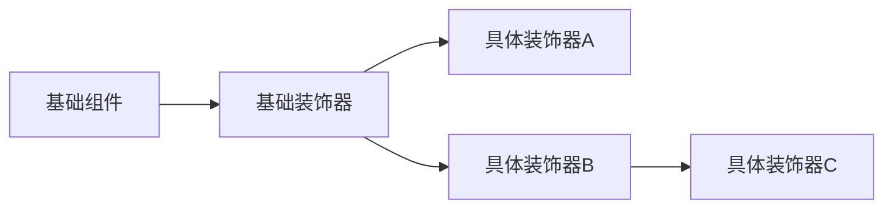
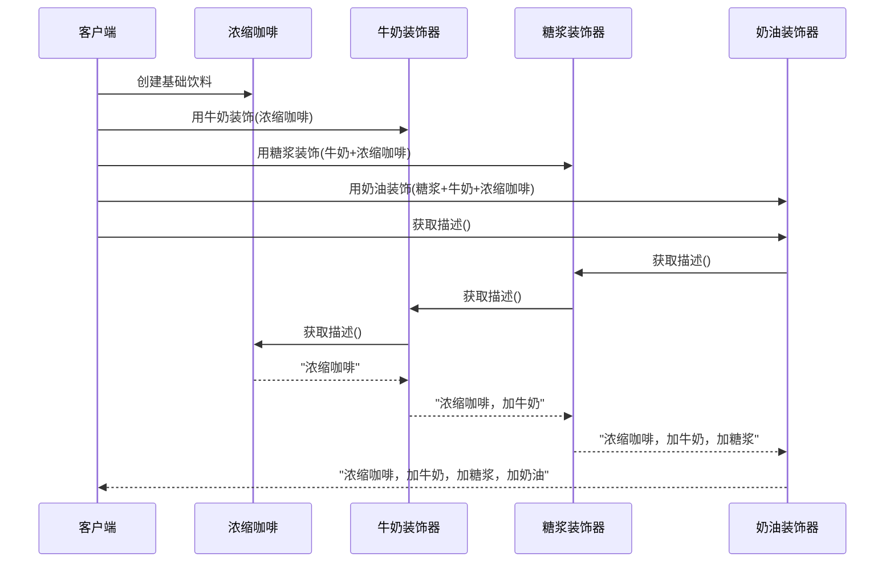

# 🎨 装饰器模式（Decorator Pattern）

## 装饰器模式的核心思想

**装饰器模式允许动态地向对象添加新功能，而不改变其结构**。它通过创建一系列"包装器"对象来实现功能扩展，提供比继承更灵活的功能增强方式。



## 装饰器模式的四大核心元素

### 1. 组件接口（Component）
```cpp
class 饮料 {
public:
    virtual ~饮料() = default;
    virtual std::string 描述() const = 0;
    virtual double 价格() const = 0;
};
```

### 2. 具体组件（Concrete Component）
```cpp
class 浓缩咖啡 : public 饮料 {
public:
    std::string 描述() const override { 
        return "浓缩咖啡"; 
    }
    
    double 价格() const override { 
        return 12.0; 
    }
};
```

### 3. 装饰器基类（Decorator）
```cpp
class 调料装饰器 : public 饮料 {
protected:
    饮料* 被装饰的饮料;

public:
    explicit 调料装饰器(饮料* 饮料实例) 
        : 被装饰的饮料(饮料实例) {}
    
    // 默认委托给被装饰对象
    std::string 描述() const override {
        return 被装饰的饮料->描述();
    }
    
    double 价格() const override {
        return 被装饰的饮料->价格();
    }
};
```

### 4. 具体装饰器（Concrete Decorators）
```cpp
class 牛奶 : public 调料装饰器 {
public:
    using 调料装饰器::调料装饰器;
    
    std::string 描述() const override {
        return 调料装饰器::描述() + "，加牛奶";
    }
    
    double 价格() const override {
        return 调料装饰器::价格() + 3.0;
    }
};

class 糖浆 : public 调料装饰器 {
public:
    using 调料装饰器::调料装饰器;
    
    std::string 描述() const override {
        return 调料装饰器::描述() + "，加糖浆";
    }
    
    double 价格() const override {
        return 调料装饰器::价格() + 2.0;
    }
};

class 奶油 : public 调料装饰器 {
public:
    using 调料装饰器::调料装饰器;
    
    std::string 描述() const override {
        return 调料装饰器::描述() + "，加奶油";
    }
    
    double 价格() const override {
        return 调料装饰器::价格() + 4.0;
    }
};
```

## 装饰器模式工作流程

### 动态组合过程


### 客户端使用示例
```cpp
int main() {
    // 创建基础饮料
    饮料* 我的饮料 = new 浓缩咖啡();
    std::cout << 我的饮料->描述() 
              << "，价格：" << 我的饮料->价格() << "元\n";
    
    // 第一次装饰：加牛奶
    我的饮料 = new 牛奶(我的饮料);
    std::cout << 我的饮料->描述() 
              << "，价格：" << 我的饮料->价格() << "元\n";
    
    // 第二次装饰：加糖浆
    我的饮料 = new 糖浆(我的饮料);
    std::cout << 我的饮料->描述() 
              << "，价格：" << 我的饮料->价格() << "元\n";
    
    // 第三次装饰：加奶油
    我的饮料 = new 奶油(我的饮料);
    std::cout << 我的饮料->描述() 
              << "，价格：" << 我的饮料->价格() << "元\n";
    
    // 输出：
    // 浓缩咖啡，价格：12元
    // 浓缩咖啡，加牛奶，价格：15元
    // 浓缩咖啡，加牛奶，加糖浆，价格：17元
    // 浓缩咖啡，加牛奶，加糖浆，加奶油，价格：21元
    
    delete 我的饮料;
    return 0;
}
```

## 装饰器模式高级技巧

### 1. 多重装饰嵌套
```cpp
// 创建豪华咖啡
饮料* 豪华咖啡 = new 奶油(
                  new 糖浆(
                    new 牛奶(
                      new 浓缩咖啡())));
```

### 2. 装饰器移除（需要额外设计）
```cpp
class 可移除装饰器 : public 调料装饰器 {
public:
    using 调料装饰器::调料装饰器;
    
    // 添加移除装饰器的方法
    饮料* 移除() {
        饮料* 基础饮料 = 被装饰的饮料;
        被装饰的饮料 = nullptr; // 防止双重删除
        delete this;
        return 基础饮料;
    }
};

// 使用示例
饮料* 咖啡 = new 牛奶(new 浓缩咖啡());
咖啡 = static_cast<可移除装饰器*>(咖啡)->移除();
```

### 3. 智能指针管理
```cpp
std::shared_ptr<饮料> 创建拿铁() {
    auto 咖啡 = std::make_shared<浓缩咖啡>();
    return std::make_shared<牛奶>(咖啡.get());
}

// 更安全的装饰链
auto 摩卡 = std::shared_ptr<饮料>(
    new 奶油(
        new 糖浆(
            new 牛奶(
                new 浓缩咖啡())));
```

## 装饰器模式优势

1. **动态扩展**：运行时添加或移除功能
2. **避免子类爆炸**：替代多层继承结构
3. **单一职责原则**：每个装饰器只关注单一功能
4. **开闭原则**：不修改已有代码即可扩展功能
5. **组合自由**：任意顺序组合装饰器

## 装饰器模式应用场景

### 1. 图形界面组件
```cpp
可视化组件* 文本框 = new 文本框();
文本框 = new 滚动条装饰器(文本框); // 添加滚动条
文本框 = new 边框装饰器(文本框);   // 添加边框
文本框->绘制();
```

### 2. 输入/输出流增强
```cpp
std::ifstream 基础文件("data.txt");
std::istream 缓冲流(基础文件.rdbuf()); // 缓冲装饰
std::istream 压缩流(缓冲流.rdbuf());  // 解压装饰
```

### 3. 中间件处理
```cpp
Http请求* 请求 = new 基础请求();
请求 = new 认证中间件(请求);   // 添加认证
请求 = new 日志中间件(请求);   // 添加日志
请求 = new 缓存中间件(请求);   // 添加缓存
请求->处理();
```

### 4. 游戏装备系统
```cpp
角色* 玩家 = new 基础角色();
玩家 = new 武器装饰器(玩家, "宝剑");   // 装备武器
玩家 = new 盔甲装饰器(玩家, "板甲");  // 装备盔甲
玩家 = new 饰品装饰器(玩家, "戒指");  // 装备饰品
玩家->攻击(); // 计算装备加成后的攻击力
```

## 装饰器模式最佳实践

1. **接口一致性**：装饰器必须实现组件接口的所有方法
2. **透明性设计**：客户端不应感知装饰器的存在
3. **轻量级装饰**：避免在装饰器中实现复杂逻辑
4. **生命周期管理**：使用智能指针避免内存泄漏
5. **装饰顺序控制**：重要装饰应放在外层

```cpp
// 正确的装饰顺序：基础功能在内层，关键功能在外层
auto 安全服务 = std::make_shared<加密装饰器>(
                 std::make_shared<压缩装饰器>(
                   std::make_shared<基础服务>()));

// 错误的顺序：先加密后压缩会导致无法解压
auto 错误服务 = std::make_shared<压缩装饰器>(
                 std::make_shared<加密装饰器>(
                   std::make_shared<基础服务>()));
```

## 装饰器模式 vs 继承

| 特性         | 装饰器模式                  | 继承                     |
|--------------|-----------------------------|--------------------------|
| **灵活性**   | 动态添加/移除功能           | 编译时固化               |
| **组合性**   | 任意组合装饰器              | 单一路径继承             |
| **子类数量** | 少量装饰器类                | 需要大量子类             |
| **扩展性**   | 符合开闭原则                | 修改基类影响所有子类     |
| **复杂度**   | 对象关系复杂                | 类结构简单               |

> **设计哲学**：装饰器模式是"即插即用"的面向对象实现，它让功能扩展像搭积木一样灵活自由。当你需要动态地为对象添加职责时，装饰器模式是比继承更优雅的解决方案。

## 总结思考

装饰器模式的核心价值在于它解决了**静态继承**在功能扩展上的局限性。通过使用组合而非继承，它实现了：

1. **运行时动态扩展**：随时添加或移除功能
2. **无限组合可能**：装饰器可以嵌套多层
3. **功能正交设计**：每个装饰器只关注单一职责
4. **系统解耦**：新增功能不影响现有代码

在游戏开发中，装饰器模式特别适用于：
- 角色装备系统
- 技能/状态效果叠加
- UI元素样式定制
- 输入/输出流处理链

当你的系统需要**动态增强对象功能**且**避免类爆炸**时，装饰器模式是最佳选择之一。
