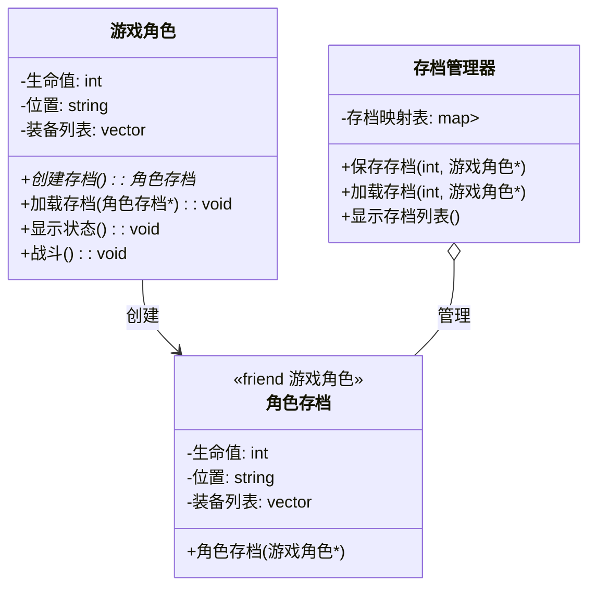

### 备忘录模式（Memento Pattern）详解

#### 模式定义
**备忘录模式**在不破坏封装性的前提下，捕获一个对象的内部状态，并在该对象之外保存这个状态。这样以后就可将该对象恢复到原先保存的状态。

#### 核心组件
| 角色        | 职责                               | 游戏存档示例             |
|------------|-----------------------------------|------------------------|
| **Originator** (原发器) | 创建备忘录并存储当前状态，也可从备忘录恢复状态 | 游戏角色               |
| **Memento** (备忘录)   | 存储原发器的内部状态                | 存档文件               |
| **Caretaker** (管理者) | 负责保存和管理备忘录                | 存档管理系统           |

---

### 游戏存档系统示例
#### 场景描述
假设我们有一个游戏角色系统：
1. 角色具有生命值、位置、装备等状态
2. 玩家可以随时保存角色状态（存档）
3. 玩家可以加载之前的存档（读档）
4. 需要支持多个存档槽位管理

#### 类图结构


---

### 模式优势

1. **状态封装**
   - 备忘录对象只暴露给原发器，保证状态细节的封装性
   - 管理者无法修改备忘录内容，确保状态完整性

2. **简化原发器**
   - 状态保存和恢复逻辑从原发器中分离
   - 原发器无需管理历史状态存储

3. **时间点恢复**
   - 支持任意时刻状态快照
   - 实现"后悔机制"（如撤销操作）

4. **状态持久化**
   - 备忘录可序列化实现长期保存
   - 支持跨会话状态恢复

---

### 进阶应用：游戏存档系统扩展

#### 1. 存档压缩与加密
```cpp
class 加密存档 : public 角色存档 {
public:
    加密存档(const 游戏角色& 角色, const std::string& 密钥)
        : 角色存档(角色), 密钥(密钥) {
        压缩并加密数据();
    }
    
    // 解密接口（仅原发器可访问）
    friend class 游戏角色;
    void 解密数据() const {
        // 解密实现...
    }
    
private:
    void 压缩并加密数据() {
        // 压缩和加密实现...
    }
    
    mutable bool 已解密 = false;
    std::string 密钥;
};

// 在游戏角色中添加
std::unique_ptr<角色存档> 游戏角色::创建加密存档(const std::string& 密钥) const {
    return std::make_unique<加密存档>(*this, 密钥);
}
```

#### 2. 增量存档
```cpp
class 增量存档 : public 角色存档 {
public:
    增量存档(const 游戏角色& 当前状态, const 角色存档& 基础存档)
        : 角色存档(当前状态),
          基础存档标识(基础存档.获取时间戳()) {
        // 计算差异
        差异.生命值 = 当前状态.生命值 - 基础存档.获取生命值();
        // 其他属性差异计算...
    }
    
    void 应用差异(游戏角色& 角色) const {
        角色.设置生命值(角色.获取生命值() + 差异.生命值);
        // 应用其他差异...
    }
    
private:
    struct 状态差异 {
        int 生命值;
        // 其他差异字段...
    } 差异;
    
    time_t 基础存档标识;
};
```

#### 3. 存档元数据管理
```cpp
class 存档管理器 {
public:
    void 保存存档(int 槽位, 游戏角色* 角色, const std::string& 备注 = "") {
        auto 存档 = std::make_unique<存档元数据>();
        存档->快照 = 角色->创建存档();
        存档->保存时间 = std::chrono::system_clock::now();
        存档->游戏版本 = 当前游戏版本;
        存档->备注 = 备注;
        
        存档映射表[槽位] = std::move(存档);
    }
    
    void 显示详细存档列表() const {
        for (const auto& [槽位, 元数据] : 存档映射表) {
            auto 时间点 = std::chrono::system_clock::to_time_t(元数据->保存时间);
            std::cout << std::format("槽位 {}: {:%Y-%m-%d %H:%M} | 版本 {} | {}\n",
                槽位, *std::localtime(&时间点), 元数据->游戏版本, 元数据->备注);
        }
    }
    
private:
    struct 存档元数据 {
        std::unique_ptr<角色存档> 快照;
        std::chrono::system_clock::time_point 保存时间;
        std::string 游戏版本;
        std::string 备注;
    };
    
    std::map<int, std::unique_ptr<存档元数据>> 存档映射表;
    inline static const std::string 当前游戏版本 = "1.4.2";
};
```

#### 4. 云端存档同步
```cpp
class 云存档服务 {
public:
    void 上传存档(int 槽位, const 角色存档& 存档) {
        // 序列化存档
        std::string 序列化数据 = 序列化(存档);
        
        // 加密传输
        发送到云端(槽位, 序列化数据);
    }
    
    std::unique_ptr<角色存档> 下载存档(int 槽位) {
        auto 数据 = 从云端获取(槽位);
        return 反序列化(数据);
    }
    
private:
    std::string 序列化(const 角色存档& 存档) {
        // 实现序列化逻辑
        return {};
    }
    
    std::unique_ptr<角色存档> 反序列化(const std::string& 数据) {
        // 实现反序列化逻辑
        return nullptr;
    }
};

// 扩展存档管理器
class 云存档管理器 : public 存档管理器 {
public:
    void 备份到云端(int 槽位) {
        if (auto 本地存档 = 获取存档(槽位)) {
            云服务.上传存档(槽位, *本地存档);
        }
    }
    
    void 从云端恢复(int 槽位) {
        if (auto 云端存档 = 云服务.下载存档(槽位)) {
            存档映射表[槽位] = std::move(云端存档);
        }
    }
    
private:
    云存档服务 云服务;
};
```

### 备忘录模式最佳实践

1. **状态选择策略**
   - 仅保存必要状态（如位置、关键属性）
   - 排除临时数据（如动画状态、粒子效果）

2. **性能优化**
   ```cpp
   // 使用写时复制（Copy-on-Write）技术
   class 高效存档 : public 角色存档 {
   public:
       高效存档(const 游戏角色& 角色)
           : 共享状态(std::make_shared<const 内部状态>(角色)) {}
       
       int 获取生命值() const override { return 共享状态->生命值; }
       // ... 其他访问器
   
   private:
       struct 内部状态 {
           int 生命值;
           std::string 位置;
           std::vector<std::string> 装备列表;
           // ... 构造函数
       };
       
       std::shared_ptr<const 内部状态> 共享状态;
   };
   ```

3. **版本兼容**
   ```cpp
   void 游戏角色::加载存档(const 角色存档* 存档) {
       // 版本检查
       if (存档->版本号 > 当前支持版本) {
           throw std::runtime_error("存档版本不兼容");
       }
       
       // 向后兼容处理
       if (存档->版本号 < 最低兼容版本) {
           转换旧版本存档(存档);
       }
       
       // 正常加载...
   }
   ```

4. **安全恢复**
   ```cpp
   void 安全加载存档(角色存档* 存档) {
       try {
           // 创建临时角色验证存档
          游戏角色 临时角色("验证者", 0, "");
          临时角色.加载存档(存档);
           
           // 验证通过后应用
          this->加载存档(存档);
       } catch (const std::exception& e) {
          std::cerr << "存档损坏: " << e.what() << "\n";
       }
   }
   ```

### 模式对比：备忘录 vs 其他模式

| 模式         | 目的                     | 游戏应用场景         | 与备忘录的区别         |
|-------------|--------------------------|---------------------|-----------------------|
| **备忘录**   | 状态捕获与恢复           | 游戏存档系统         | 核心关注状态保存       |
| **命令**     | 封装请求为对象           | 操作回放/撤销        | 关注操作而非状态       |
| **原型**     | 通过克隆创建对象         | 怪物生成             | 创建新对象而非保存状态 |
| **状态**     | 封装基于状态的行为变化   | 角色行为状态机       | 管理当前行为而非历史状态 |

---

### 使用场景总结

1. **游戏开发**
   - 角色/游戏状态存档
   - 关卡进度保存
   - 回放系统状态捕获

2. **应用软件**
   - 文档编辑历史
   - 表单数据恢复
   - 配置状态保存

3. **系统开发**
   - 事务回滚
   - 系统快照
   - 错误恢复点

> **注意事项**：当需要保存的状态很大或很复杂时，需考虑性能优化（如增量存储、懒加载）。同时要注意状态版本兼容性问题，特别是长期维护的项目。
