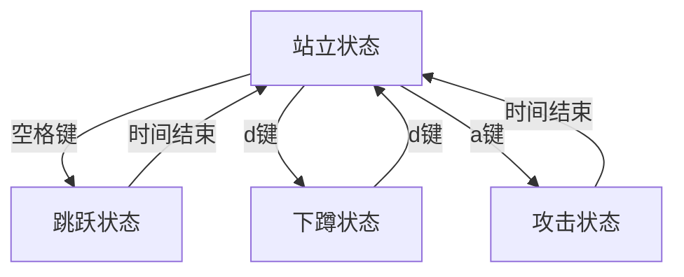

# 游戏开发中的状态模式文档

## 状态模式概述
状态模式是一种行为设计模式，允许对象在其**内部状态改变时改变其行为**。在游戏开发中，它特别适用于管理角色状态（如站立、跳跃、攻击）和游戏流程状态（如菜单、游戏中、暂停）。

### 核心组件
| 组件 | 描述 | 代码示例 |
|------|------|----------|
| **上下文(Context)** | 持有当前状态的对象 | `游戏角色`类 |
| **状态接口(State)** | 定义所有状态必须实现的方法 | `状态接口`类 |
| **具体状态(Concrete States)** | 实现特定状态的行为 | `站立状态`、`跳跃状态`等 |

## 状态模式的优势
1. **单一职责原则**：每个状态类只负责自身行为
2. **开闭原则**：添加新状态无需修改现有代码
3. **消除复杂条件语句**：避免庞大的if-else或switch-case结构
4. **状态转换明确**：状态切换逻辑清晰可见
5. **行为局部化**：状态相关行为集中在一个类中

## 代码实现解析

### 状态接口
```cpp
class 状态接口 {
public:
    virtual void 进入() = 0;
    virtual void 退出() = 0;
    virtual void 更新(float 时间差) = 0;
    virtual void 处理输入(char 输入) = 0;
    virtual std::string 获取状态名() const = 0;
};
```

### 上下文：游戏角色
```cpp
class 游戏角色 {
public:
    void 切换状态(std::unique_ptr<状态接口> 新状态) {
        if (当前状态) 当前状态->退出();
        当前状态 = std::move(新状态);
        当前状态->进入();
    }
    // ...其他方法...
private:
    std::unique_ptr<状态接口> 当前状态;
};
```

### 具体状态示例：跳跃状态
```cpp
class 跳跃状态 : public 状态接口 {
public:
    跳跃状态(游戏角色& 角色) : 角色(角色) {}
    
    void 进入() override { 
        std::cout << "进入跳跃状态\n"; 
        剩余时间 = 1.0f;
    }
    
    void 更新(float 时间差) override {
        剩余时间 -= 时间差;
        if (剩余时间 <= 0) {
            角色.切换状态(角色.创建站立状态());
        }
    }
    // ...其他方法实现...
};
```

## 状态转换流程



1. **初始化**：角色从站立状态开始
2. **输入处理**：
   - 空格键：站立 → 跳跃
   - d键：站立 ↔ 下蹲
   - a键：站立 → 攻击
3. **自动转换**：
   - 跳跃状态：1秒后自动返回站立
   - 攻击状态：0.5秒后自动返回站立

## 扩展新状态的步骤
1. 创建新状态类（如`受伤状态`）
```cpp
class 受伤状态 : public 状态接口 {
public:
    受伤状态(游戏角色& 角色) : 角色(角色) {}
    // 实现所有虚函数...
};
```

2. 在上下文类中添加创建方法
```cpp
class 游戏角色 {
public:
    std::unique_ptr<状态接口> 创建受伤状态();
    // ...
};
```

3. 实现创建方法
```cpp
std::unique_ptr<状态接口> 游戏角色::创建受伤状态() {
    return std::make_unique<受伤状态>(*this);
}
```

4. 在需要处触发状态切换
```cpp
// 在攻击状态处理输入中
void 攻击状态::处理输入(char 输入) override {
    if (输入 == 'h') { // 受到攻击
        角色.切换状态(角色.创建受伤状态());
    }
}
```

## 输出示例分析
```
进入站立状态
初始状态: 站立

按下空格键（跳跃）
退出站立状态
进入跳跃状态
当前状态: 跳跃

更新游戏（0.7秒后）
退出跳跃状态
进入站立状态
当前状态: 站立
```

输出展示了：
1. 状态进入/退出的生命周期
2. 状态间的无缝转换
3. 时间驱动的状态自动切换
4. 输入驱动的状态切换

## 最佳实践
1. **状态轻量化**：避免在状态类中存储过多数据
2. **共享状态**：对于无实例数据的可复用状态，考虑使用单例
3. **状态参数化**：通过上下文传递状态间共享数据
4. **层次化状态**：复杂场景可使用状态嵌套（子状态）
5. **状态机可视化**：使用工具监控状态转换流程

## 适用场景
- 角色行为管理（移动、战斗、交互）
- 游戏流程控制（菜单、游戏中、暂停）
- AI状态机（巡逻、追击、逃跑）
- 动画状态切换
- 游戏对象生命周期管理

状态模式通过将每个状态的行为封装在独立的类中，显著提高了代码的可维护性和扩展性，是游戏开发中管理复杂状态转换的理想选择。
