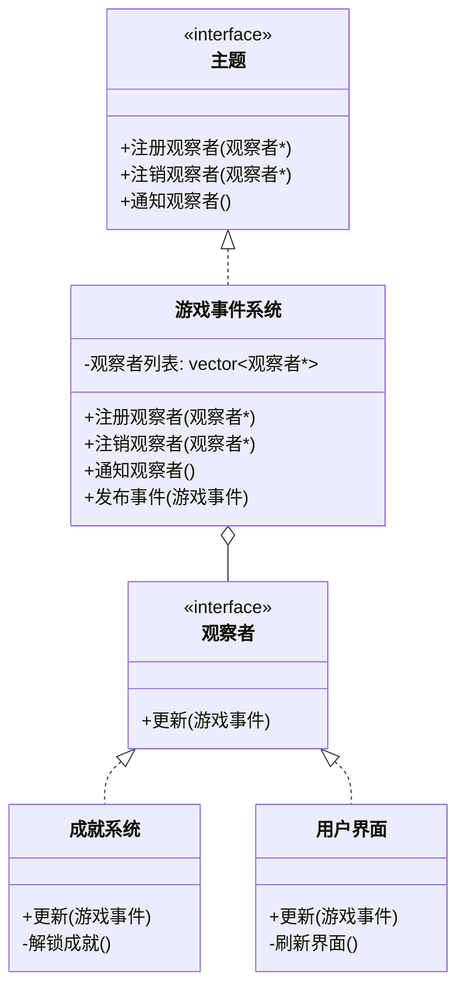

# 观察者模式（Observer Pattern）详解

## 模式定义
**观察者模式**定义了对象之间的一对多依赖关系，当一个对象（主题）状态改变时，所有依赖它的对象（观察者）都会自动收到通知并更新。这种模式是事件驱动编程的核心。

### 核心组件
| 角色 | 职责 | 游戏示例 |
|------|------|----------|
| **Subject** (主题) | 管理观察者列表，提供注册/注销接口 | 游戏事件系统 |
| **Observer** (观察者) | 定义更新接口 | 成就系统、UI组件 |
| **ConcreteSubject** (具体主题) | 状态改变时通知观察者 | 玩家状态 |
| **ConcreteObserver** (具体观察者) | 实现更新逻辑 | 成就追踪器 |

---

## 游戏事件系统示例
### 场景描述
假设我们有一个游戏事件系统：
1. 玩家状态变化时（生命值、位置、等级）
2. 各种游戏事件发生时（获得物品、击败敌人）
3. 多个系统需要响应这些事件：
   - 成就系统：追踪特定成就
   - UI系统：更新界面显示
   - 存档系统：自动保存进度
   - 日志系统：记录游戏事件

### 类图结构



## 观察者模式的优势

1. **松耦合**
   - 主题和观察者独立变化
   - 新增观察者无需修改主题
   - 观察者之间互不知晓

2. **动态关系**
   ```cpp
   // 运行时添加/移除观察者
   事件系统.注册观察者(&新系统);
   事件系统.注销观察者(&旧系统);
   ```

3. **广播通信**
   - 一次状态变化通知多个观察者
   - 简化一对多依赖管理

4. **事件驱动架构**
   ```mermaid
   sequenceDiagram
       玩家->>事件系统: 发布事件(击败敌人)
       事件系统->>成就系统: 更新事件
       事件系统->>UI系统: 更新事件
       事件系统->>存档系统: 更新事件
       成就系统->>成就系统: 检查成就条件
       成就系统-->>界面: 显示成就解锁
       存档系统->>存档系统: 执行自动存档
   ```

---

## 进阶实现：现代C++特性

### 1. 使用智能指针管理观察者
```cpp
class 游戏事件系统 : public 主题 {
public:
    void 注册观察者(std::shared_ptr<观察者> 观察者) {
        观察者列表.push_back(观察者);
    }

    void 注销观察者(std::shared_ptr<观察者> 观察者) {
        std::erase(观察者列表, 观察者);
    }
``

### 2. 使用函数式编程风格
```cpp
class 游戏事件系统 {
public:
    using 事件处理函数 = stack(std::move(处理函数));
    }nst auto& 处理函数 : 处理函数列表) {
            处理函数(事件);
        }
    }

private:
    std::vector<事件处理函数> 处理函数列表;
};

// 使用lambda注册
事件系统.注册观察者([](const 游戏事件& 事件) {
    if (事件.类型 == 事件类型::玩家升级) {
        std::cout << "玩家升级事件处理\n";
    }
});
```

### 3. 事件过滤与优先级
```cpp
class 高级事件系统 : public 主题 {
public:
    struct 观察者注册 {
        std::shared_ptr<观察者> 观察者;
        事件类型 关注类型;
        int 优先级;
    };
    
    void 注册观察者(std::shared_ptr<观察者> 观察者, 
                  事件类型 关注类型 = 事件类型{}, 
                  int 优先级 = 0) 
    {
        注册列表.push_back({std::move(观察者), 关注类型, 优先级});
        // 按优先级排序
        std::sort(注册列表.begin(), 注册列表.end(), 
            [](const auto& a, const auto& b) {
                return a.优先级 > b.优先级;
            });
    }
    
    void 通知观察者(const 游戏事件& 事件) override {
        for (const auto& 注册 : 注册列表) {
            // 如果指定了关注类型且不匹配，则跳过
            if (注册.关注类型 != 事件类型{} && 
                注册.关注类型 != 事件.类型) 
            {
                continue;
            }
            注册.观察者->更新(事件);
        }
    }

private:
    std::vector<观察者注册> 注册列表;
};
```

### 4. 异步事件处理
```cpp
#include <future>
#include <queue>
#include <thread>
#include <mutex>
#include <condition_variable>

class 异步事件系统 : public 主题 {
public:
    异步事件系统() {
        工作线程 = std::thread([this] { 事件循环(); });
    }
    
    ~异步事件系统() {
        {
            std::lock_guard 锁(队列互斥);
            停止 = true;
        }
        条件变量.notify_one();
        工作线程.join();
    }
    
    void 发布事件(事件类型 类型, const std::string& 来源, 
                 const std::string& 目标 = "", int 数值 = 0,
                 const std::string& 位置 = "") 
    {
        {
            std::lock_guard 锁(队列互斥);
            事件队列.push({类型, 来源, 目标, 数值, 位置});
        }
        条件变量.notify_one();
    }
    
    void 事件循环() {
        while (true) {
            std::unique_lock 锁(队列互斥);
            条件变量.wait(锁, [this] { 
                return !事件队列.empty() || 停止; 
            });
            
            if (停止) break;
            
            auto 事件 = 事件队列.front();
            事件队列.pop();
            锁.unlock();
            
            通知观察者(事件);
        }
    }

private:
    std::thread 工作线程;
    std::queue<游戏事件> 事件队列;
    std::mutex 队列互斥;
    std::condition_variable 条件变量;
    bool 停止 = false;
};
```

---

## 观察者模式的应用场景

| 应用领域       | 使用场景                     | 优势                     |
|---------------|----------------------------|-------------------------|
| **游戏开发**   | 成就系统、任务系统           | 解耦游戏逻辑和追踪系统   |
|                | UI更新（血条、地图）         | 实时响应状态变化         |
|                | AI事件响应                  | 简化事件处理流程         |
| **GUI应用**    | 按钮点击事件处理             | 分离界面和业务逻辑       |
|                | 数据绑定                    | 自动更新视图             |
| **分布式系统** | 消息队列                    | 解耦生产者和消费者       |
|                | 微服务事件通知              | 服务间松耦合通信         |
| **金融系统**   | 股票价格变动通知            | 实时更新多个客户端       |

## 模式对比：观察者 vs 其他模式

| 模式          | 目的                     | 与观察者的区别           |
|---------------|--------------------------|-------------------------|
| **观察者**     | 一对多的状态通知         | 核心关注状态变化通知     |
| **中介者**     | 集中对象间通信           | 通过中介对象通信         |
| **发布-订阅** | 通过消息代理解耦         | 有中间件，更松散的耦合   |
| **责任链**    | 请求通过处理器链传递     | 关注请求处理而非状态通知 |

## 最佳实践与注意事项

1. **避免循环引用**
   - 使用弱指针（`weak_ptr`）管理观察者引用
   - 确保主题不持有观察者的强引用

2. **性能优化**
   - 批量处理事件减少通知次数
   - 使用事件过滤减少不必要通知
   - 异步处理耗时操作

3. **内存管理**
   ```cpp
   // 自动注销模式
   class 自动注册观察者 : public 观察者 {
   public:
       自动注册观察者(主题& 主题) : 主题(主题) {
           主题.注册观察者(this);
       }
       
       ~自动注册观察者() {
           主题.注销观察者(this);
       }
   };
   ```

4. **事件风暴预防**
   - 限制事件频率
   - 合并相似事件
   - 添加事件重要性级别

观察者模式是构建灵活、可扩展事件系统的基石，特别适合游戏开发中复杂的交互场景。通过合理应用，可以创建高度解耦、易于维护的游戏架构。
    

